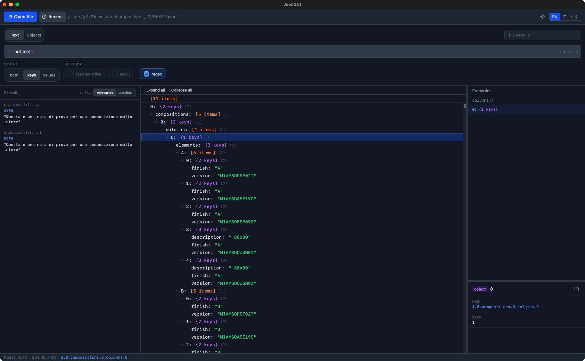

# JsonGUI

A fast, native desktop app for exploring and searching large JSON files.
Built with Tauri 2 + React 18 + TypeScript.



---

## Features

- Open and explore JSON files of any size (lazy tree loading)
- Full-text search across keys, values, or both — powered by Rayon for parallel execution
- Right-click context menu: copy JSONPath, value, or raw JSON subtree
- Keyboard navigation in the tree (Arrow keys, Enter)
- Recent files list (last 5, persisted in localStorage)
- Drag and drop a JSON file from Finder/Explorer directly onto the window
- Status bar with node count, file size, and path
- Dark UI with Tailwind CSS

---

## Requirements

- macOS 12+ (Apple Silicon or Intel) — primary target
- [Rust stable toolchain](https://rustup.rs/)
- Node.js 22+
- npm 10+

---

## Install

```bash
npm install
```

---

## Usage

Launch in development mode (hot-reload):

```bash
npm run tauri:dev
```

Build a release bundle:

```bash
npm run tauri:build
```

---

## Development

```bash
# TypeScript type check only
npx tsc --noEmit

# Rust check only
cd src-tauri && cargo check

# Rust tests
cd src-tauri && cargo test
```

---

## Architecture

```
Frontend (React + Zustand)
  TreeNode (lazy expand)   SearchPanel
          |                     |
          +------Tauri IPC------+
                     |
Backend (Rust)
  JsonIndex (arena Vec<Node>)
  SearchEngine (rayon parallel)
  FileLoader (sonic-rs SIMD parser)
```

### Key technical choices

**sonic-rs** — Replaces `serde_json` for the initial JSON parsing phase.
Uses SIMD instructions (NEON on Apple Silicon, AVX2 on x86_64) for significantly
faster deserialization of large files. Produces a standard `serde_json::Value`
so the rest of the tree-building code is unchanged.

**Arena allocation** — The entire JSON tree is stored as a flat `Vec<Node>`
where each node holds integer indices to its children. This avoids recursive
heap allocations and keeps the data cache-friendly. Navigation is O(1) by index.

**Lazy loading** — The frontend only requests children for nodes the user expands
via the `get_children` IPC command. Root children are returned with `open_file`.
This keeps initial load fast regardless of file size.

**Rayon** — The `search` function uses `par_iter()` to scan all nodes in parallel,
distributing work across all CPU cores automatically.

---

## License

MIT
