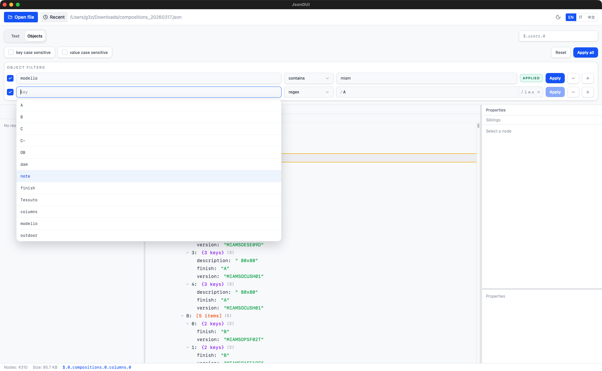

# JsonGUI

A fast, native desktop app for exploring and searching large JSON files.
Built with Tauri 2 + React 19 + TypeScript.




---

## Features

- Open and explore JSON files of any size (lazy tree loading)
- Full-text search across keys, values, or both — powered by Rayon for parallel execution
- Object search with multiple property filters, nested property paths, per-row apply, and apply-all
- Property path autocomplete in object search
- Right-click context menu: copy JSONPath, value, or raw JSON subtree
- Keyboard navigation in the tree (Arrow keys, Enter)
- Recent files list (last 5, persisted in localStorage)
- Search filters persisted per file in localStorage
- Drag and drop a JSON file from Finder/Explorer directly onto the window
- Status bar with node count, file size, and path
- Dark UI with Tailwind CSS

---

## Requirements

- macOS 12+ (Apple Silicon or Intel) — primary target
- [Rust stable toolchain](https://rustup.rs/)
- Node.js 22+
- npm 10+

---

## Install

```bash
npm install
```

---

## Usage

Launch in development mode (hot-reload):

```bash
npm run tauri:dev
```

Build a release bundle:

```bash
npm run tauri build
```

On macOS, `npm run tauri build` now creates the `.app` with Tauri and then
generates the `.dmg` from an external staging directory to avoid the `create-dmg`
temporary-image recursion issue.

---

## Search

JsonGUI provides two search modes: **Text** and **Objects**.

### Text search

Use text search when you want to scan the whole document for:

- keys only
- values only
- both keys and values

Available options:

- case sensitive
- regex
- exact match
- scope path, to limit the search to a subtree such as `$.users.0`
- sort by relevance or file order

### Object search

Use object search when you want to find objects matching one or more property conditions.

Each row contains:

- an enable/disable checkbox
- a property path
- an operator
- a value, when required
- an `Apply` button for that single row

You can also use `Apply all` to run all enabled rows together as an `AND` query.

Supported operators:

- `contains`
- `equals`
- `regex`
- `exists`

When `exists` is selected, the value field is hidden because no comparison value is needed.

### Nested property paths

Property paths can target nested data using dot notation.

Examples:

- `marketing_lingua`
- `content.mainImage`
- `content.mainImage.0.url`
- `product.details.title`

In other words, you can use `key.key` for nested object lookups, and continue deeper as needed.
Array indexes can be included as path segments as well.

### Object search options

Object search also supports:

- separate case sensitivity for property keys and property values
- path autocomplete based on existing keys in the current file
- per-file filter persistence in localStorage
- scope path limitation, so object search can run inside a specific subtree only

### Typical examples

Find objects where a nested URL contains a domain:

```text
content.mainImage.0.url contains example.com
```

Find objects where a property exists:

```text
marketing_lingua exists
```

Find objects that match multiple conditions:

```text
marketing_lingua contains Acciaio
finish equals Lucido
```

---

## Development

```bash
# TypeScript type check only
npx tsc --noEmit

# Rust check only
cd src-tauri && cargo check

# Rust tests
cd src-tauri && cargo test
```

---

## Benchmarks

### Rust (Criterion)

Measures parsing, BFS + DTO build, IPC serialization and `build_raw` on synthetic data:

```bash
cd src-tauri && cargo bench
# HTML reports: src-tauri/target/criterion/
```

To benchmark against a real JSON file, create `.bench.env` in the project root
(already in `.gitignore`) with the path to your large file:

```bash
cp .bench.env.example .bench.env
# edit .bench.env:
# BENCH_JSON_PATH=/path/to/large.json

cd src-tauri && cargo bench -- real_file
```

### GitHub Actions perf smoke test

A lightweight CI workflow is available in
[`/.github/workflows/performance.yml`](.github/workflows/performance.yml).
It generates a deterministic JSON dataset of about 64 MiB, then measures:

- `load` via `JsonIndex::from_file`
- `search_text` over values
- `search_regex` over values
- `search_objects` with a nested property path filter
- `expand_all` via the same BFS helper used by the Rust benchmarks
- structural memory metrics from the built index (`heap_bytes_estimate`, bytes per node, bytes per input byte)

Each run publishes:

- a Markdown summary directly in the GitHub Actions job summary
- a `rust-perf-smoke` artifact containing `perf-ci.json` and `perf-ci-summary.md`

This is meant to track trends over time from the Actions panel, not to act as a
strict pass/fail performance budget: GitHub-hosted runners are noisy.

For tagged releases, the same benchmark snapshot is also appended to the draft
release notes by [`/.github/workflows/release.yml`](.github/workflows/release.yml),
so the release page contains the measured `load`, `search_text`,
`search_regex`, `search_objects`, `expand_all`, and structural memory numbers
for that version.

You can run the same smoke test locally with:

```bash
cd src-tauri
cargo run --release --example perf_ci -- \
  --size-mib 64 \
  --iterations 3 \
  --sample-path target/perf-ci-sample.json \
  --output target/perf-ci.json
```

### JavaScript (frontend)

Measures `buildVisibleNodes`, Map copy cost, and streaming overhead on synthetic trees:

```bash
npx tsx src/bench/perf.mts
```

## Architecture

```
Frontend (React + Zustand)
  TreeNode (lazy expand)   SearchPanel
          |                     |
          +------Tauri IPC------+
                     |
Backend (Rust)
  JsonIndex (arena Vec<Node>)
  SearchEngine (rayon parallel)
  FileLoader (sonic-rs SIMD parser)
```

---

## License

MIT
